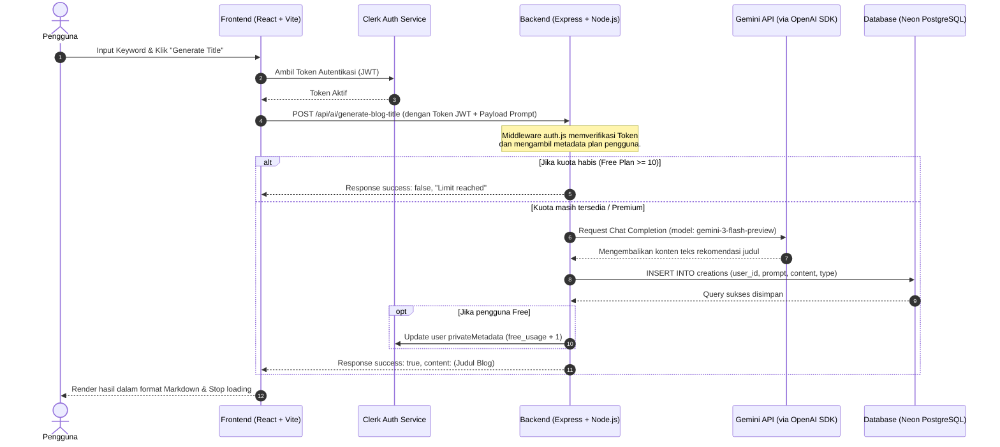

# 🌐 Alur Lengkap Aplikasi (Request-Response Lifecycle)

Dokumen ini menjelaskan alur lengkap pemrosesan data pada platform **AI SaaS Platform**, mulai dari interaksi di **Frontend (Client)**, pengiriman request ke **Backend (Server)**, interaksi dengan **Database (Neon PostgreSQL)** & **External Service (Gemini API & Cloudinary)**, hingga response dikirimkan kembali ke pengguna.

---

## 🗺️ Diagram Alur (Sequence Diagram)

Berikut adalah visualisasi alur request-response ketika pengguna menggunakan fitur AI di platform:



---

## 📂 Penjelasan Detail Setiap Tahap

Kita menggunakan contoh kasus nyata pada fitur **AI Title Generator (Blog Title)** (`client/src/pages/BlogTitles.jsx`):

### 1. Frontend (Client) - Pengiriman Request
1. **Aksi Pengguna:** Pengguna menginput kata kunci ke form dan menekan tombol **"Generate title"**.
2. **State & Loading:** Aplikasi mengubah state `loading` menjadi `true` untuk memicu animasi loading spinner di tombol kirim.
3. **Pengambilan Token Autentikasi:** Sebelum mengirim request ke server, client memanggil fungsi pembantu dari SDK **Clerk** (`useAuth`) untuk mendapatkan token JWT unik (JSON Web Token) yang memvalidasi identitas user saat ini secara aman:
   ```javascript
   const { getToken } = useAuth();
   const token = await getToken();
   ```
4. **Pengiriman Payload Axios:** Frontend mengirimkan HTTP `POST` request ke backend menggunakan **Axios** ke endpoint `/api/ai/generate-blog-title` dengan menyisipkan token tersebut di header `Authorization` (Bearer Token) dan data prompt di body request:
   ```javascript
   const { data } = await axios.post(
     "/api/ai/generate-blog-title",
     { prompt },
     { headers: { Authorization: `Bearer ${await getToken()}` } }
   );
   ```

---

### 2. Request ke Backend (Server) - Routing & Middleware
1. **Penerimaan Request:** Request diterima oleh Express server di `server/server.js` dan dicocokkan dengan route yang terdaftar:
   ```javascript
   app.use("/api/ai", aiRouter);
   ```
2. **Middleware Autentikasi (`auth.js`):** Sebelum mengeksekusi logika utama, request harus melewati middleware keamanan `auth` di `server/middlewares/auth.js`.
   * Middleware ini menggunakan fungsi bawaan Clerk SDK untuk mengekstrak `userId` dari header token.
   * Middleware mengecek apakah user memiliki plan `"premium"`.
   * Jika tidak premium, data kuota gratis (`free_usage`) yang disimpan di metadata Clerk pengguna akan divalidasi dan dilewatkan melalui objek `req`:
     ```javascript
     const { userId, has } = await req.auth();
     const hasPremiumPlan = await has({ plan: "premium" });
     // ...
     req.plan = hasPremiumPlan ? "premium" : "free";
     ```

---

### 3. Logika Controller & Interaksi Database / AI Service
Jika lolos dari middleware keamanan, controller utama di `server/controllers/aiController.js` dijalankan:
1. **Validasi Kuota:** Jika plan pengguna adalah `free` dan nilai `free_usage` sudah mencapai/melebihi batas (10x pemakaian), server akan langsung memotong alur kerja dan mengembalikan respon error.
2. **Request ke Gemini AI (via OpenAI SDK):** Server mengirim request chat completion menggunakan API Gemini melalui SDK OpenAI yang dikonfigurasi menggunakan Base URL khusus:
   ```javascript
   const response = await AI.chat.completions.create({
     model: "gemini-3-flash-preview",
     messages: [{ role: "user", content: prompt }],
     temperature: 0.7,
     max_tokens: 100,
   });
   const content = response.choices[0].message.content;
   ```
3. **Penyimpanan ke Database (Neon PostgreSQL):** Data hasil kreasi disimpan secara permanen ke tabel `creations` di database Neon Serverless PostgreSQL lewat template query sql aman:
   ```javascript
   await sql`
     INSERT INTO creations (user_id, prompt, content, type) 
     VALUES (${userId}, ${prompt}, ${content}, 'blog-title')
   `;
   ```
4. **Pembaruan Kuota User (di Clerk):** Jika pengguna berada pada plan `free`, backend akan mengirim request ke API Clerk untuk menaikkan nilai `free_usage` sebanyak `1` di private metadata:
   ```javascript
   await clerkClient.users.updateUserMetadata(userId, {
     privateMetadata: { free_usage: free_usage + 1 }
   });
   ```

---

### 4. Response Kembali ke Frontend & Pembaruan UI
1. **HTTP Response dari Server:** Server mengirim status sukses dan konten teks hasil generate ke frontend:
   ```javascript
   res.json({ success: true, content });
   ```
2. **Penerimaan Respon di Frontend:** Frontend menangkap data respon tersebut. Jika berhasil (`data.success === true`), state `content` diisi dengan hasil kembalian dari backend:
   ```javascript
   if (data.success) {
     setContent(data.content);
   } else {
     toast.error(data.message);
   }
   ```
3. **Mengakhiri Status Loading:** State `loading` diubah kembali menjadi `false` untuk menghentikan animasi loading di layar.
4. **Rerender Halaman:** React secara reaktif mendeteksi perubahan state `content` dan melakukan re-render komponen secara dinamis. Hasil teks akan diformat dengan baik ke dalam elemen UI menggunakan komponen `<Markdown>`:
   ```jsx
   <div className="reset-tw">
     <Markdown>{content}</Markdown>
   </div>
   ```

---

## 🗃️ Detail Tambahan untuk Alur Fitur Lainnya

* **Image Generation / Background Removal / Object Removal:**
  * Alur routing, autentikasi, dan database-nya sama.
  * Perbedaannya terletak pada penggunaan **Cloudinary SDK** untuk menyimpan gambar hasil olahan AI, serta penyimpanan `secure_url` gambar ke dalam kolom `content` di database Neon.
* **Resume Review (Unggah File PDF):**
  * Menggunakan middleware **Multer** di backend untuk menangani pengunggahan file resume secara sementara.
  * Menggunakan library `unpdf` untuk mengekstrak teks mentah dari file PDF sebelum teks tersebut dikirimkan ke model AI untuk ditinjau.
